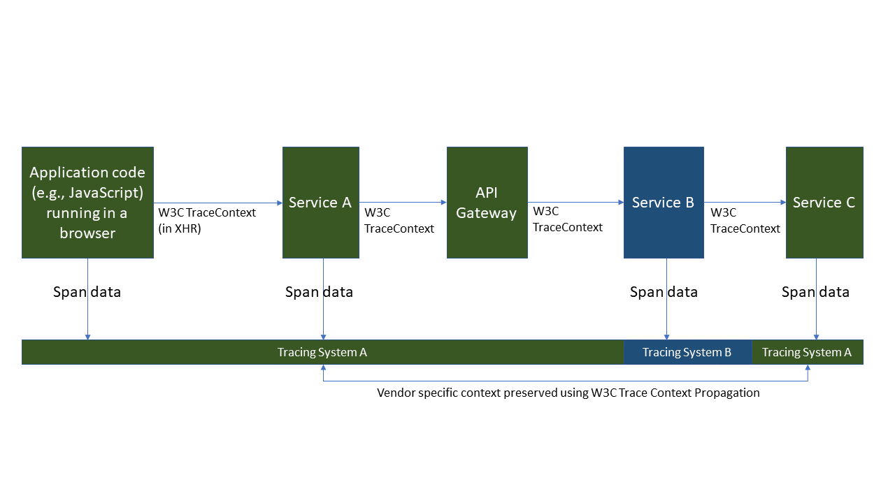

# Distributed Tracing Working Group

## Introduction
The Distributed Tracing Working Group currently drives the standardization of two specifications:

- W3C TraceContext
- W3C Baggage

Let's dive more into what these specifications cover and the need for them.

## W3C TraceContext

### What is W3C TraceContext?
The W3C TraceContext specification defines a universally agreed upon format to propagate trace context data. It specifies standard HTTP headers and standard value formats. It also defines a mechanism to forward vendor-specific trace data.

These headers can also be propagated by systems that are not monitored but still need to participate in the trace to allow end-to-end tracing. The target implementation for the current version of the specification is applications and services; browsers/user-agents are not in scope.

### What problem does it solve: Improving the Observability of complex distributed systems
Understanding what is happening in a complex distributed system can be a challenge.

In a complex distributed system, a single logical operation can involve work done by hundreds of participants. When an operation is delayed or encountered an error in such a system, you want to get to one logical explanation of what is happening to that operation. But the distributed nature of this system makes it a challenge. Sure, each participant will have its own view of how it handled its request in the context of the overall operation.

But how do you tie them all together to understand what is happening? More generally, how do we gain the ability to answer questions about a system to understand it better: who all participated in handling an operation? What is the critical path? Where do failures happen? What characteristics did orders that took more than 20 minutes have in common? What are the performance trends over time? What are the reliability trends over time?

You should be able to ask any such question and get answers. This specification helps improve the observability of systems in an open and vendor-neutral way.

### The building blocks needed to tie things together into a "Distributed Trace"
Let’s look at a few key building blocks needed to tie things together:

First, we need a way to *uniquely identify a logical operation* flowing through a system.

We also *need a way for each participant to know* this unique identifier. This is so that each participant can associate what it is doing to handle its part of that operation. But how can each participant know this? One participant would have to first create this identifier, and then it needs to be propagated all other participants. The propagation mechanism will be protocol specific: e.g., for HTTP, an obvious choice is to use HTTP headers for propagation.

We also need to be able to uniquely identify (within the scope of a single logical operation) the unit of work done by each participant.

But the above is not enough: we also need to establish the causality of the work done by different participants. For this, we need a way to capture the parent/child relationships: when a participant calls another, the callee/child needs to know the unique identifier of the caller/parent’s unit of work, so that the child can emit it. How does the child get this? It must be propagated.

If we have all the above, we will gain the ability to connect the dots together.

The set of related events emitted by various participants, triggered by the same logical operation, is called a distributed trace. The context that is propagated between the participants is referred to as the “trace context” that includes the identifiers described above.

### Why does it have to be a standard?
If there is no standardized way to propagate the trace context, each tracing system would have to create its own method. Typically, this would be in the form of a custom HTTP header. If an operation is handled by multiple participants using different tracing systems, such headers will not be propagated between them and the trace will be broken. When this happens, we will not able to reason about the whole system.

To make things interoperable, we need a standard mechanism that everybody can agree to use.

### Goals

- To provide a standard mechanism to propagate trace context across various applications and services so that multiple tracing platforms can be used in concert with each other.
- To provide a method for application developers to trace requests without invading users' privacy.

### Non Goals
- Identification of individual users or user sessions.
- Definition of (programming) language specific APIs for performance data collection.
- Performance data analysis techniques or algorithms.

### Concepts

#### Distributed Trace
A distributed trace is a set of events, triggered as a result of a single logical operation, consolidated across various components of an application. A distributed trace contains events that cross process, network and security boundaries. A distributed trace may be initiated when someone presses a button to start an action on a website - in this case, the trace will represent calls made between the downstream services that handled the chain of requests initiated by this button being pressed.

##### Headers

###### Traceparent

The traceparent header is a request header which contains a trace id, a parent span id, and trace flags. The traceflags includes information such as if a particular request is sampled. When a tracing system transmits a span to the tracing backend, it includes the Trace ID, the span ID, and the parent span ID (if one exists). The tracing backend uses this information to construct the directed acyclic graph which represents the trace. In a system with a single tracing platform, it is the only header necessary to complete a distributed trace.

###### Tracestate

The tracestate header is a request header which allows a tracing platform to transmit platform-specific information, even through systems that are traced using other tracing platforms. Each tracing platform uses a single key, and the value is treated as an opaque token by other tracing platforms. Each tracing platform is required to forward tracestate keys and values.

### Examples

#### Context loss using a proprietary header

1. Service A calls Service B through an API gateway.
2. The tracing system uses a proprietary header to propagate its trace ID.
3. The API gateway is not configured to propagate the proprietary header.
4. Service B does not receive a trace ID and context is lost.

#### Context propagation with W3C Trace Context
1. Service A calls Service B through an API gateway.
2. The tracing system uses the W3C Trace Context headers.
3. The API gateway recognizes the headers as standard-compliant and propagates them.
4. Service B receives the trace ID and continues the trace.

## W3C Baggage

### What is W3C Baggage?
This specification defines a standard for representing and propagating a set of application-defined properties associated with a distributed request or workflow execution.

This is independent of the Trace Context specification. Baggage can be used regardless of whether distributed tracing is used. This specification standardizes representation and propagation of application-defined properties. In contrast, Trace Context specification standardizes representation and propagation of the metadata needed to enable distributed tracing scenarios.

### Why is this needed?
Applications and libraries can use baggage to attach user-defined properties as part of a distributed request. A framework can automatically propagate this data to downstream services as part of the distributed context. The benefit of the cross-cutting nature of this context propagation means that it doesn't require any changes in the participating services (e.g., to change API signatures) to propagate these parameters.

There are two main categories of use cases of baggage:

- Use cases that enable better *observability* of a system.
- Use cases that enable better *control* of a system.

To learn about these use cases, please see [Baggage Use Cases](https://github.com/w3c/baggage/blob/main/baggage/README.md).
