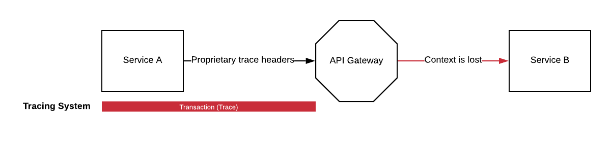
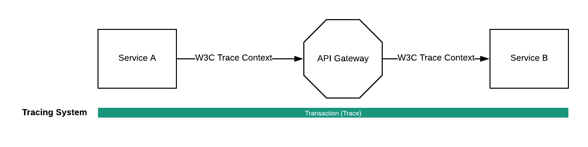
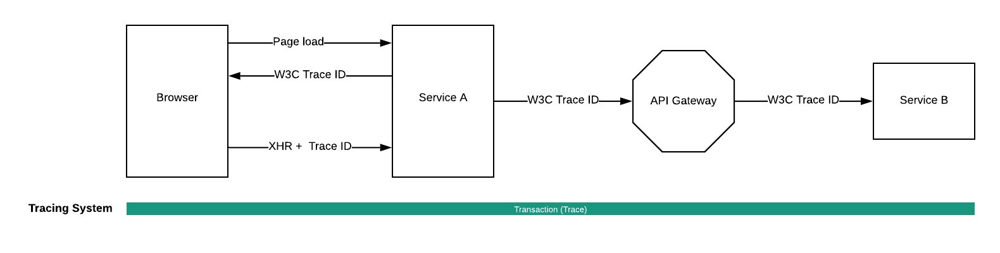

# Distributed Tracing Working Group

## What is it?

We propose a set of HTTP headers which propagate a distributed trace, even when a request and its associated trace is served by multiple tracing providers.

## Why do we care?

Because there is no standardized way to propagate a trace, each tracing vendor has to create their own method of propagating tracing information. Typically this is in the form of a custom HTTP header. If an application request which is traced by one system flows through a system which is not traced using the same tracing platform, the headers may not be correctly propagated and the trace may be broken.

## Goals

- To provide a way in which heterogeneous architectures with multiple tracing platforms to operate in concert with each other
- To provide a method for application developers to trace requests without invading users' privacy

## Non-goals
- Identification of individual users or user sessions
- Definition of (programming) language specific APIs for performance data collection
- Performance data analysis techniques or algorithms

## Concepts

### Distributed Trace
A distributed trace is the directed acyclic graph which represents a single operation, request, or user action, where each node in the graph is a span.

### Span
A span is a single operation within a distributed trace. For example, if a trace represents a user clicking on "Checkout," the request from the client to the server would be a single span, each request made by that server to other services would be a span, each database request would be a span, and so on.

### Trace Flags
Trace flags communicate information about the trace to remote tracing systems. Currently, the only information transmitted with the trace is whether or not a particular request is "sampled," or captured by a tracing system.

## Headers

### Traceparent

The traceparent header is a request header which contains a trace id, a parent span id, and trace flags. A tracing system transmits the trace ID, span ID, and the ID of each span's parent span, if it exists, with each span to a tracing backend. The tracing backend uses this information to construct the directed acyclic graph which represents the trace. In a system with a single tracing platform, it is the only header necessary to complete a distributed trace.

### Tracestate

The tracestate header is a request header which allows a tracing platform to transmit platform-specific information, even through systems which are traced using other tracing platforms. Each tracing platform uses a single key, and the value is treated as an opaque token by other tracing platforms. Each tracing platform is required to forward tracestate keys and values.

### Trace Response header

We also propose a response header which can be used to report a trace ID back to the caller to
- report back a new trace ID in case the callee, ignored the existing headers but started a new trace
- let proxies delegate sampling decisions to the caller
- allow tail-based sampling, where a sampling decision is deferred until a request is completed and all information pertinent to the sampling decision is known
- to correlate the initial page load of a browser and all subsequent requests to a server side trace

### Baggage

The baggage header is used to propagate properties not defined in trace parent.
There are two common use cases. First is to define a context on trace initiation.
Such context will have customer's identity, high-level operation name and other properties like a flight name.

## Examples

### Context loss using a proprietary header

1. Service A calls Service B through an API gateway.
2. The tracing system uses a proprietary header to propagate its trace ID.
3. The API gateway is not configured to propagate the proprietary header
4. Service C does not receive a trace ID and context is lost

### Context propagation with W3C Trace Context
1. Service A calls Service B through an API gateway
2. The tracing system uses the W3C Trace Context header
3. The API gateway operates standard compliant
4. Service C receives the trace ID and continues the trace

### Response header used to correlate a browser request
1. The browser does an initial request (page load)
2. Service A starts the trace and sends back a response header that identifies the root span
3. The browser uses this information to provide a trace ID for all subsequent requests within this one load cycle

## Privacy
The introduction of a trace ID and response headers, naturally raises privacy concerns.
In summary it can be said, that everything the standard covers can be accomplished today
using existing technologies.
The standard provides an agreed-upon format to enable interoperability and additionally
adds privacy constraints that didn't exist before.

### Can a propgated trace ID be used to identify individual users?
Using proprietary ways of trace context propagation, vendors could always encode
information that contains user identifyable data.
The spec, on the other hand introduces [clear and strict privacy constraints](https://www.w3.org/TR/trace-context/#privacy-of-traceparent-field) that
forbid encoding user identifyable data.
As such, the standard restricts techniques that would be valid in proprietary trace context propagation solutions and leads
to better overall privacy awareness in the industry.

### Can a response header returned to the browser be used to identify users?
Again, proprietary implementations already use different ways to solve this problem.
Namely, the same can be achieved by:
- encoding an ID into the payload returned to the browser
- encoding an ID into server response timings

The intent of the standard is not to identify individual users but to provide a way
to tie frontend traces to backend traces to monitor performance.
Consequently, reloading a page would result in a new request and a new, random trace
ID sent back to the browser.

### Can baggage be used to identify users?
Using proprietary ways of context propagation, vendors could always encode
information that contains user identifyable data.
Today, baggage is used to add information like a marker to distinguish transactions for
a/b testing.